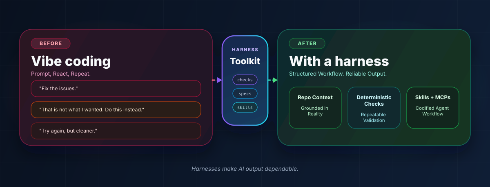

# AI Harness Toolkit

> **Stop stitching AI workflows together with ad-hoc prompts. Give your repository the structure it needs to make agent-assisted engineering repeatable, reliable, and high-quality at scale.**

   

---

## Table of Contents

- [At a Glance](#at-a-glance)
- [Why This Exists](#why-this-exists)
- [Who This Is For](#who-this-is-for)
- [Core Workflows](#core-workflows)
- [Supporting Skills](#supporting-skills)
- [Quick Start](#quick-start)
- [Learn More](#learn-more)
- [Contributing](#contributing)
- [Security](#security)
- [License](#license)

---

## At a Glance

| If you want to… | Start here |
| --- | --- |
| Bootstrap high-quality agent-driven development with deterministic checks, specs, and clear guardrails | [ai-harness-setup](skills/ai-harness-setup/README.md) |
| Score your repository's AI-native maturity and get prioritized next steps | [ai-native-assessment](skills/ai-native-assessment/README.md) |

---

## Why This Exists

If you are adopting AI tooling in a real repository, you usually need the same foundations: clear repository guidance, deterministic checks, spec-driven change management, and a practical way to measure maturity. This toolkit packages those patterns into reusable skills so you can standardize your workflow instead of rebuilding it from scratch.

This approach is inspired by the principles described in OpenAI's [Harness Engineering](https://openai.com/index/harness-engineering/) post, where repository legibility, enforced architecture, and structured knowledge become the leverage that makes agent-driven development produce high-quality results at scale.

Ad hoc prompting can be useful for quick exploration, but it breaks down when you need reliable, high-quality output and shared standards. This toolkit helps you turn AI assistance into work that is easier to validate, maintain, and improve over time.

| | Unstructured vibe coding | Using this toolkit |
| --- | --- | --- |
| **Workflow** | Relies on individual prompting style and memory | Uses reusable skills and documented workflows you can apply consistently |
| **Validation** | Produces uneven validation and review practices | Encourages deterministic checks, repository guidance, and explicit workflow structure |
| **Scale** | Works for isolated experiments but is hard to scale | Helps you standardize setup, measure maturity, and improve your repository systematically |

---

## Who This Is For

| Audience | How it helps you |
| --- | --- |
| **Engineering teams** | Bring structure to agent-assisted development in your repository so it becomes more reliable, consistent, and high-quality without reinventing the workflow |
| **Platform and developer tooling teams** | Standardize repository setup, documentation, and validation patterns across your projects |
| **Repository owners evaluating readiness** | Measure AI-native maturity and turn the results into a concrete improvement backlog |

---

## Core Workflows

| Workflow | Primary skill | What it helps you do |
| --- | --- | --- |
| **Bootstrap your repository** | [ai-harness-setup](skills/ai-harness-setup/README.md) | Add repository guidance, deterministic checks, skill wiring, and supporting documentation for agent-driven workflows |
| **Assess AI-native maturity** | [ai-native-assessment](skills/ai-native-assessment/SKILL.md) | Produce a scored view of your repository's readiness with prioritized next steps |

---

## Supporting Skills

These supporting skills are bundled so the primary workflows can build on a consistent set of capabilities.

| Skill | Purpose |
| --- | --- |
| [create-pull-request-with-reviewers](skills/create-pull-request-with-reviewers/SKILL.md) | Open pull requests with reviewer recommendations based on your repository history |
| [gh-pr-comment-resolution](skills/gh-pr-comment-resolution/SKILL.md) | Fetch and resolve GitHub pull request review threads |
| [reflect-on-changes](skills/reflect-on-changes/SKILL.md) | Review recent changes and update related guidance or conventions |
| [python-best-practices](skills/python-best-practices/SKILL.md) | Improve Python code quality across anti-patterns, testing, error handling, and performance |

---

## Quick Start

Choose the workflow you want to start with, copy the command you need, and then follow the linked skill documentation for prerequisites, targets, and detailed usage.

### Bootstrap your repository

| Install option | Command |
| --- | --- |
| **APM** | `apm install cisco-open/ai-harness-toolkit/skills/ai-harness-setup -t opencode -t cursor -t copilot` |
| **npx skills** | `npx skills add https://github.com/cisco-open/ai-harness-toolkit --skill ai-harness-setup` |

### Assess AI-native maturity

| Install option | Command |
| --- | --- |
| **APM** | `apm install cisco-open/ai-harness-toolkit/skills/ai-native-assessment -t opencode -t cursor -t copilot` |
| **npx skills** | `npx skills add https://github.com/cisco-open/ai-harness-toolkit --skill ai-native-assessment` |

---

## Learn More

| Topic | Link |
| --- | --- |
| AI Harness Setup | [skills/ai-harness-setup/README.md](skills/ai-harness-setup/README.md) |
| AI-Native Assessment | [skills/ai-native-assessment/README.md](skills/ai-native-assessment/README.md) |
| Contributing guide | [CONTRIBUTING.md](CONTRIBUTING.md) |
| Security policy | [SECURITY.md](SECURITY.md) |
| License | [LICENSE](LICENSE) |

---

## Contributing

Contributions are welcome. See [CONTRIBUTING.md](CONTRIBUTING.md) for repository conventions, submission guidance, and review expectations.

## Security

If you discover a security issue, follow the reporting guidance in [SECURITY.md](SECURITY.md).

## License

Licensed under [Apache 2.0](LICENSE). Copyright 2025 Cisco Systems, Inc.

---

<!--
## Image Ideas (for later creation)

Consider one of these as the hero image at the top of the README:

1. **Before/After split-screen** – Left side shows a chaotic terminal with scattered
   prompts and no structure; right side shows a clean repository with checks passing,
   skills installed, and a scorecard. Conveys "from vibe coding to structured workflow."

2. **Workflow diagram** – A minimal flowchart: "Your Repo" → ai-harness-setup →
   (deterministic checks, specs, skills, docs) → ai-native-assessment → scored
   maturity report. Clean lines, no clutter, dark or light theme friendly.

3. **Maturity ladder** – A vertical progression graphic showing tiers (Unaware →
   Nascent → Structured → Established → Exemplary) with the toolkit logo marking
   the path upward. Reinforces the assessment angle.

4. **Toolbelt / harness metaphor** – A stylized climbing harness or utility belt with
   labeled tools (checks, specs, skills, docs) clipped in. Plays on the "harness"
   name visually.

Pick whichever resonates with the project's tone. A clean SVG or PNG at ~1200×400px
works well as a GitHub README hero banner.
-->

